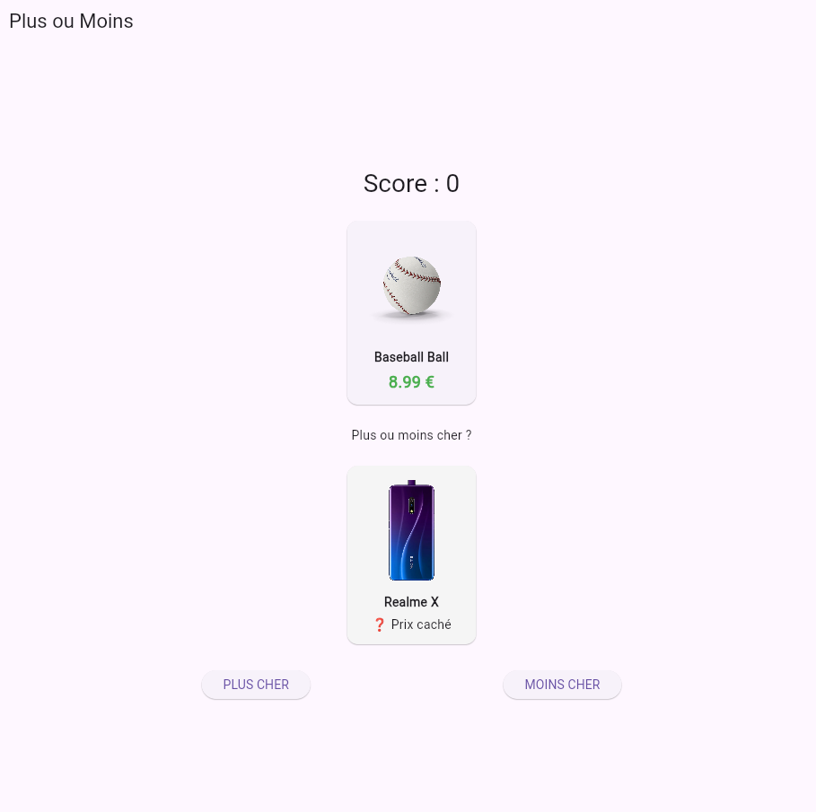
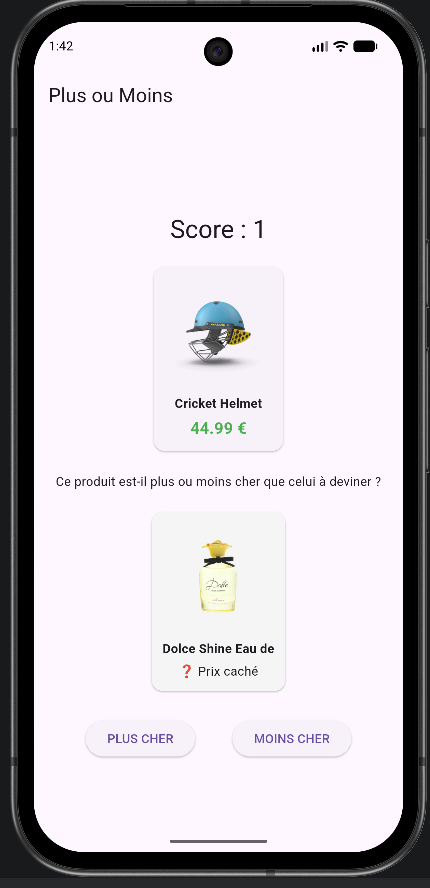
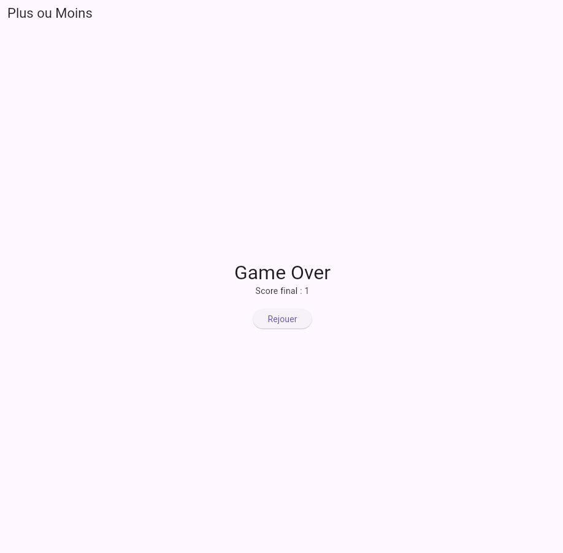
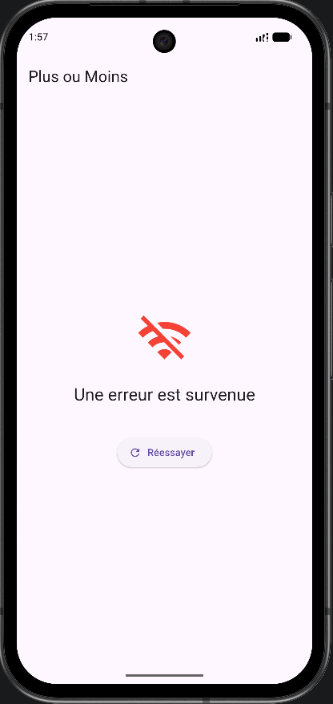

# Plus ou Moins - Jeu Flutter (version locale)

Plus ou Moins est un jeu Flutter basé sur une comparaison de prix entre deux produits.

Le joueur doit indiquer si le deuxième produit est plus cher ou moins cher que le premier.

Dans cette version (TP2), les produits ne proviennent plus d’une API mais d’une source locale embarquée dans l’application, et le meilleur score est persisté en local.

Le jeu se termine dès qu’une réponse est incorrecte. Le score correspond au nombre de bonnes réponses consécutives.

## Architecture du projet

Le projet est organisé en couches avec une abstraction de la source de données.

```
lib/
├── assets/
│   ├── images/
│   │   └── images lié au json
│   └── product.json
├── models/
│   ├── product.dart
│   └── game_state.dart
├── services/
│   └── product_api.dart
├── controllers/
│   ├── product_controller.dart
│   └── game_controller.dart
├── pages/
│   ├── game_page.dart
│   └── error_page.dart
├── services/
│   ├──sources/
│   │   ├── api_product_source.dart
│   │   ├── local_product_source.dart
│   │   └── product_source.dart
│   └── score.dart
└── main.dart
```
### Répartition des responsabilités
### Models
- `Product` : modèle de produit
- `GameState` : état du jeu (Freezed)
### Data (nouveau dans TP2)
- Interface `ProductSource`
-Implémentation `LocalProductSource` (assets JSON ou liste Dart)
- (optionnel) `ApiProductSource` conservée pour comparaison
### Services
- Gestion de la persistance du meilleur score avec SharedPreferences
### Controllers (Riverpod)
- Logique du jeu (inchangée par rapport au TP1)
- Chargement des produits via `ProductSource`
- Gestion des états (loading, playing, error, gameOver)
- Vérification des réponses et calcul du score
### UI
- Affichage uniquement
- Déclenche les actions du controller
- Ne contient aucune logique métier

## Source de données locale

Les produits proviennent soit :

- d’un fichier JSON local (`assets/products.json`)
- soit d’une liste Dart embarquée

Le contrôleur ne dépend pas de la source concrète mais uniquement de l’interface `ProductSource`.

## Persistance du meilleur score

Le meilleur score est sauvegardé avec SharedPreferences.

Logique :

- Au démarrage : récupération du best score stocké
- À la fin d’une partie : comparaison avec le score actuel
- Si nouveau record : sauvegarde
## Packages utilisés
### http

(utilisé uniquement dans l’ancienne version API si conservée)

### freezed / freezed_annotation
- gestion des modèles immuables
- gestion des états union du jeu
### json_annotation / json_serializable
- parsing JSON (assets ou API)
### shared_preferences
- stockage persistant simple (best score)
### build_runner
- génération du code Freezed / JSON
### Flutter
- framework principal de l’application

## Gestion des états

Le jeu repose toujours sur une union Freezed :
- Loading
- Playing
- Error
- GameOver

Cela garantit :
- un seul état actif à la fois
- aucune incohérence possible (ex: loading + gameOver)

## Chargement des produits (local)

Le chargement se fait via :

- lecture d’un fichier asset JSON
- parsing JSON
- transformation en List<Product>

Le chargement reste asynchrone même en local pour garder une architecture cohérente.

## Instructions de lancement
### 1. Installer les dépendances

```
flutter pub get
```

### 2. Générer le code

```
dart run build_runner build --delete-conflicting-outputs
```

### 3. Lancer l’application

```
flutter run
```

## Fonctionnalités
- Jeu complet "Plus ou Moins"
- Source de données locale (offline)
- Architecture avec abstraction de données
- Persistance du meilleur score
- Gestion des erreurs
- Interface responsive
- Modèles immuables avec Freezed

## Captures d’écran
Jeu en cours
version déconnecter (version chrome)

version connecter à internet (version android)

Game Over

version déconnecter (version chrome)

version connecter à internet (version android)


Erreur

(version android)


# Réponses aux questions du TP
### Quand préférer le local au réseau ? Conséquences?

Le local est préférable lorsque les données sont stables, peu volumineuses et doivent être disponibles immédiatement. Cela permet un fonctionnement hors ligne, de meilleures performances et une meilleure fiabilité.

En contrepartie, cela augmente la taille de l’application et rend les données statiques, nécessitant une mise à jour de l’app pour tout changement.

Le réseau est préférable lorsque les données doivent être dynamiques ou centralisées, mais il introduit une dépendance à la connexion et une latence potentielle.

### Si `http.get` était directement dans le contrôleur au TP1, que faudrait-il réécrire ? Qu’est-ce que l’interface a fait gagner ?

Si `http.get` était directement dans le contrôleur, il faudrait réécrire entièrement la partie chargement des données dans le contrôleur pour remplacer l’accès API par une source locale.

Cela impliquerait un fort couplage entre la logique du jeu et la source de données, rendant toute évolution plus coûteuse.

L’interface `ProductSource` apporte un découplage total : le contrôleur ne change pas, seule l’implémentation (API ou local) est remplacée. Cela apporte de la flexibilité, une meilleure maintenabilité et facilite les tests.

### Qu’est-ce qui est persistant ici, et qu’est-ce qui ne l’est pas ?

Dans cette application, le seul élément persistant est le meilleur score, stocké via SharedPreferences.

Le score courant, la partie en cours et la liste des produits ne sont pas persistants. Ils sont reconstruits à chaque lancement de l’application.

### SharedPreferences est-il adapté pour stocker toute la liste des produits ? Pourquoi ? Et que utiliser sinon ?

Non, SharedPreferences n’est pas adapté pour stocker une liste complète de produits.

Il est conçu uniquement pour stocker des données simples comme des int, String ou bool. Il n’est pas fait pour gérer des structures complexes ou volumineuses, ce qui rendrait son usage inefficace et difficile à maintenir.

Pour stocker des données plus complexes, il vaut mieux utiliser SQLite pour des données structurées relationnelles, ou Hive pour une base locale NoSQL plus légère et adaptée aux objets Dart.

### Que se passe-t-il sans réseau, dans chaque version ?

Dans la version TP1 (API), l’application dépend entièrement du réseau. Sans connexion internet, les produits ne peuvent pas être chargés et le jeu ne peut pas fonctionner correctement, ce qui mène généralement à un état d’erreur ou à un écran de fallback.

Dans la version TP2 (locale), le réseau n’est plus nécessaire puisque les données sont embarquées dans l’application. Le jeu fonctionne donc normalement même sans connexion ou en mode avion.

### Qui a les données les plus à jour ? Au prix de quoi ?

La version TP1 (API) possède les données les plus à jour, car elles sont récupérées dynamiquement depuis un serveur. Cela permet d’avoir un contenu évolutif sans mise à jour de l’application.

Cette fraîcheur a un coût : dépendance au réseau, latence potentielle et risque d’indisponibilité si l’API est inaccessible.

La version TP2 (locale) a des données figées, donc potentiellement obsolètes, mais gagne en stabilité et en indépendance.

### Performance / latence au démarrage

Avec l’API (TP1), le démarrage peut être légèrement plus lent car il dépend du temps de réponse du réseau et du chargement HTTP.

Avec la version locale (TP2), le chargement est quasi instantané puisque les données proviennent directement des assets intégrés à l’application. Le démarrage est donc plus rapide et plus stable.

### Taille de l’app (les assets pèsent dans le binaire)

Dans TP1, l’application reste légère car elle ne contient pas les données produits.

Dans TP2, les produits étant inclus dans les assets, la taille de l’application augmente. Plus les données sont nombreuses, plus le binaire devient lourd.

### Qu’est-ce qui survit à un redémarrage, dans chaque version ?

Dans les deux versions, le seul élément persistant est le meilleur score, stocké via SharedPreferences.

Le score actuel, la partie en cours et les produits ne survivent pas à un redémarrage. Ils sont recréés à chaque lancement de l’application, que ce soit depuis l’API (TP1) ou depuis les assets (TP2).

### Laquelle des deux approches choisir en production et pourquoi ?

Pour ce jeu, la version locale (TP2) est la plus adaptée en production. Le jeu ne nécessite pas de données dynamiques, donc une source locale suffit largement.

Elle offre une meilleure expérience utilisateur grâce au mode hors ligne, à un démarrage plus rapide et à une absence de dépendance réseau. La version API serait pertinente uniquement si le contenu devait évoluer fréquemment.
